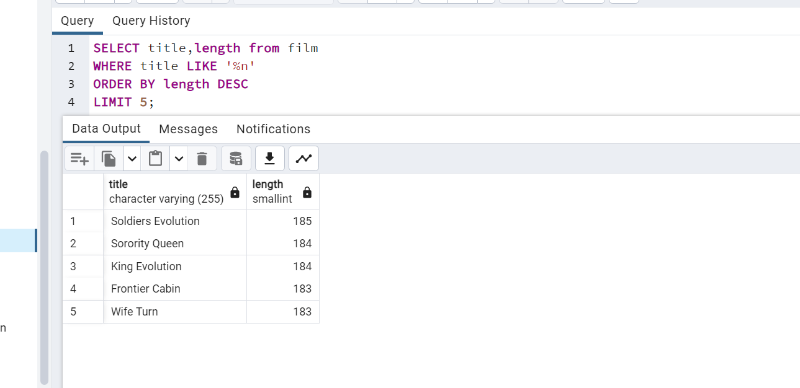
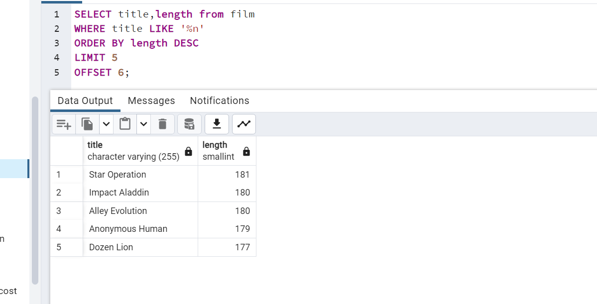
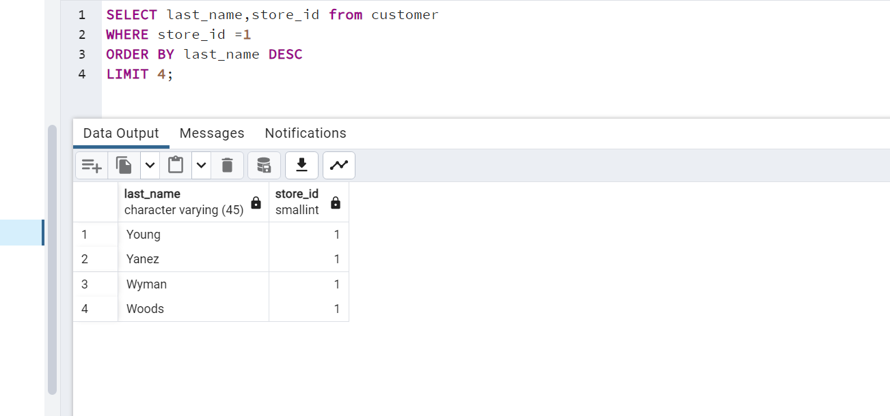

1 - film tablosunda bulunan ve film ismi (title) 'n' karakteri ile biten en uzun (length) 5 filmi sıralayınız.

----------------------------------------

2 - film tablosunda bulunan ve film ismi (title) 'n' karakteri ile biten en kısa (length) ikinci(6,7,8,9,10) 5 filmi(6,7,8,9,10) sıralayınız.

----------------------------
3 - customer tablosunda bulunan last_name sütununa göre azalan yapılan sıralamada store_id 1 olmak koşuluyla ilk 4 veriyi sıralayınız.

