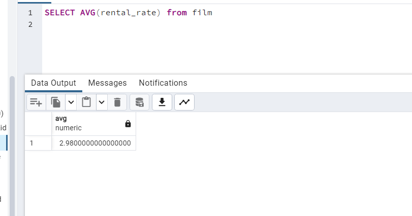
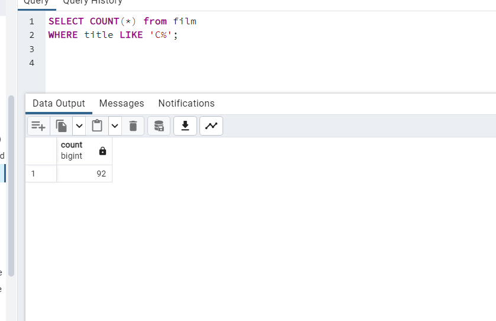
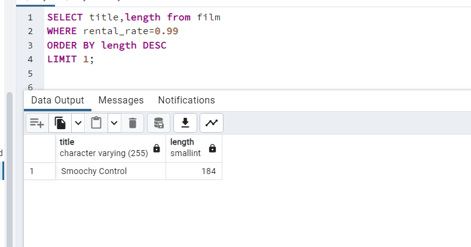
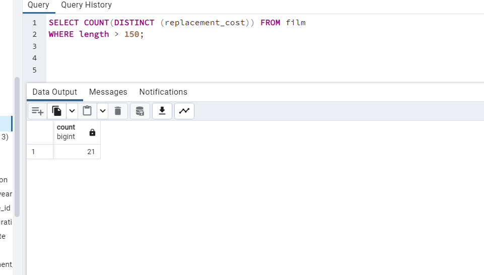

1 - film tablosunda bulunan rental_rate sütunundaki değerlerin ortalaması nedir?

-----------------------------------

2 - film tablosunda bulunan filmlerden kaç tanesi 'C' karakteri ile başlar?

----------------------

3 - film tablosunda bulunan filmlerden rental_rate değeri 0.99 a eşit olan en uzun (length) film kaç dakikadır?

---------------------------

4 - film tablosunda bulunan filmlerin uzunluğu 150 dakikadan büyük olanlarına ait kaç farklı replacement_cost değeri vardır?

