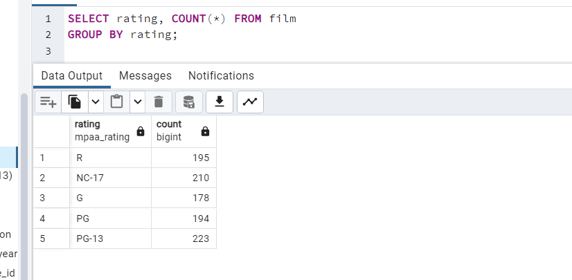
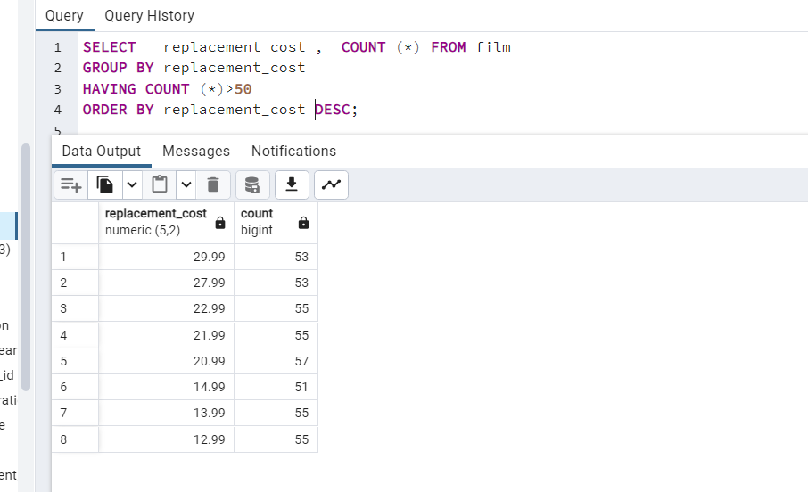
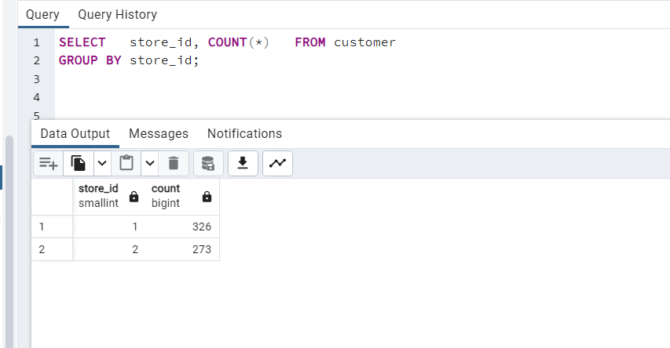
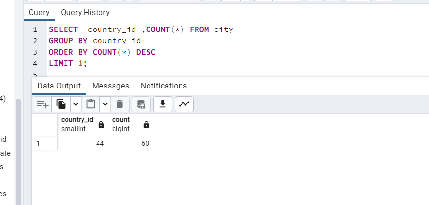

1 - film tablosunda bulunan filmleri rating değerlerine göre gruplayınız.

----------------------------------

2 - film tablosunda bulunan filmleri replacement_cost sütununa göre grupladığımızda film sayısı 50 den fazla olan replacement_cost değerini ve karşılık gelen film sayısını sıralayınız.

--------------------

3 - customer tablosunda bulunan store_id değerlerine karşılık gelen müşteri sayılarını nelerdir?

---------------------------------

4 - city tablosunda bulunan şehir verilerini country_id sütununa göre gruplandırdıktan sonra en fazla şehir sayısı barındıran country_id bilgisini ve şehir sayısını paylaşınız.

