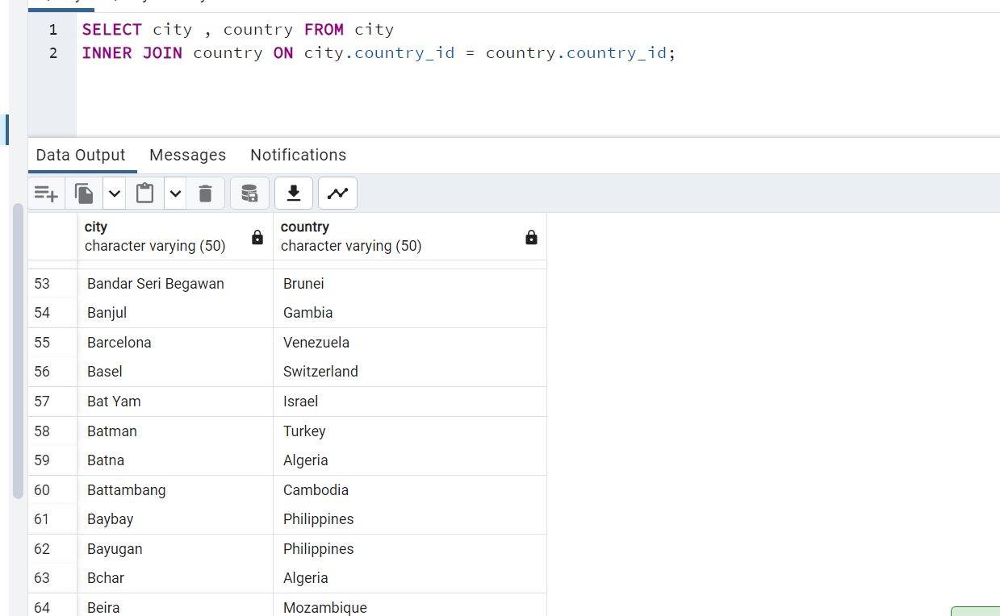
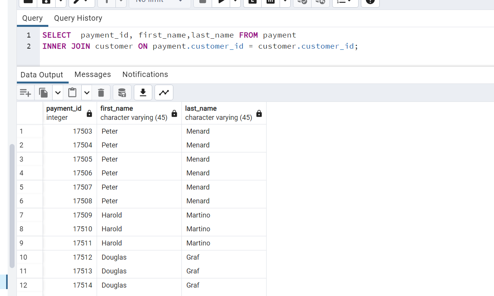
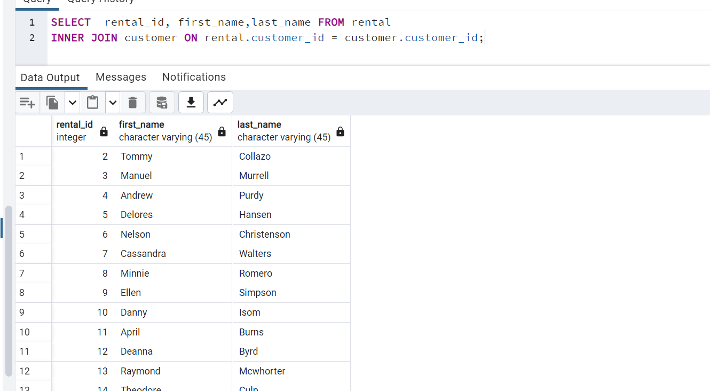

1. city tablosu ile country tablosunda bulunan şehir (city) ve ülke (country) isimlerini birlikte görebileceğimiz INNER JOIN sorgusunu yazınız.

--------------

2. customer tablosu ile payment tablosunda bulunan payment_id ile customer tablosundaki first_name ve last_name isimlerini birlikte görebileceğimiz INNER JOIN sorgusunu yazınız.

------------------

3. customer tablosu ile rental tablosunda bulunan rental_id ile customer tablosundaki first_name ve last_name isimlerini birlikte görebileceğimiz INNER JOIN sorgusunu yazınız.

