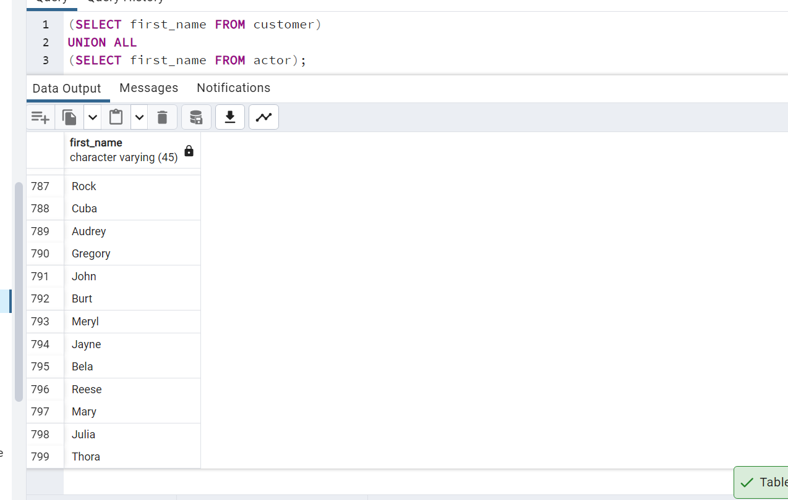

1. actor ve customer tablolarında bulunan first_name sütunları için tüm verileri sıralayalım.

-------------

2. actor ve customer tablolarında bulunan first_name sütunları için kesişen verileri sıralayalım.

---------------

3. actor ve customer tablolarında bulunan first_name sütunları için ilk tabloda bulunan ancak ikinci tabloda bulunmayan verileri sıralayalım.

---------------

4. İlk 3 sorguyu tekrar eden veriler için de yapalım.

-----------------

