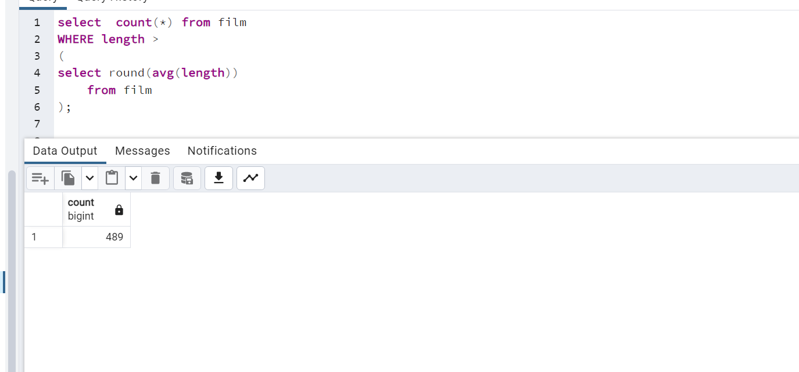
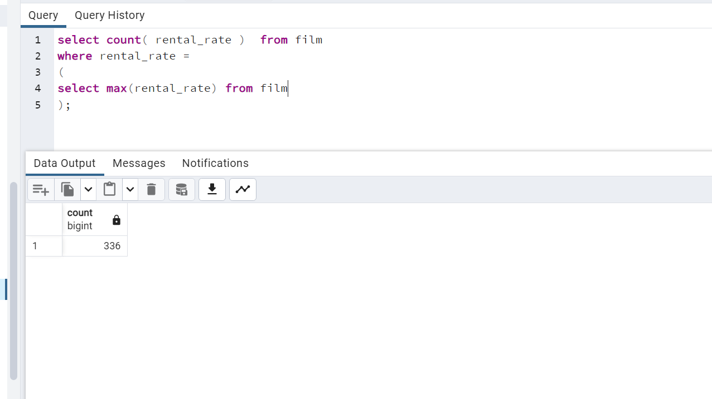
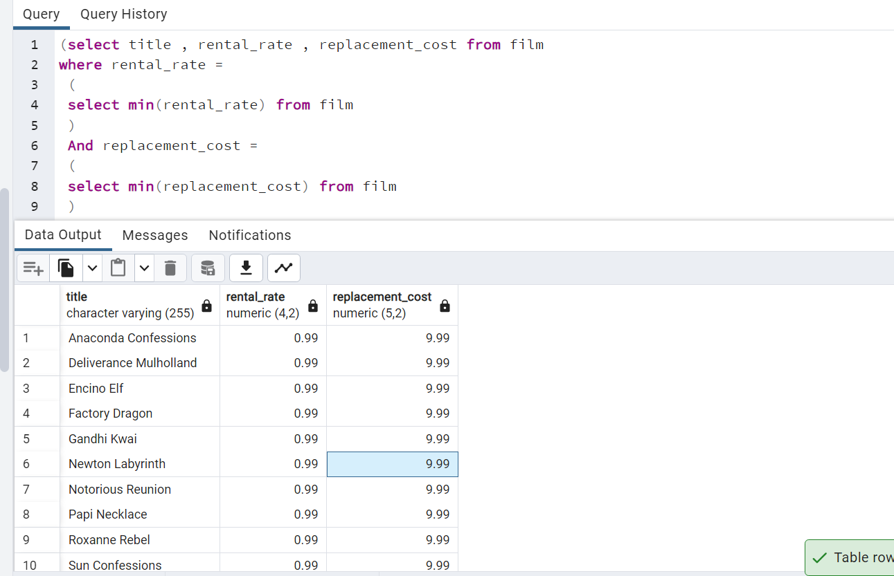
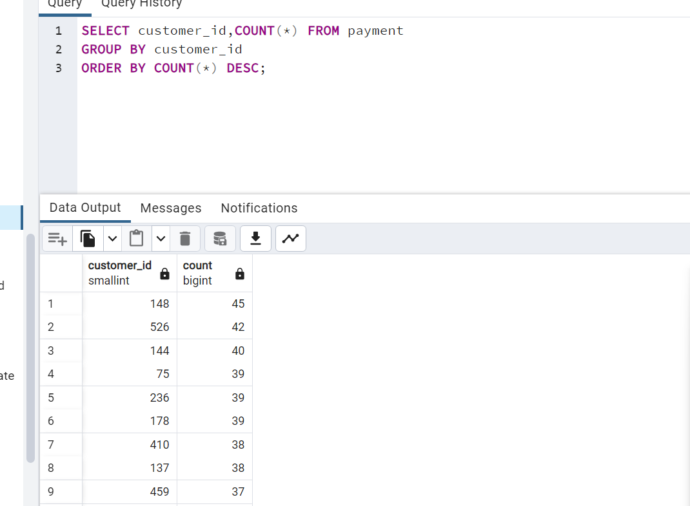

1. film tablosunda film uzunluğu length sütununda gösterilmektedir. Uzunluğu ortalama film uzunluğundan fazla kaç tane film vardır?

----------------

2. film tablosunda en yüksek rental_rate değerine sahip kaç tane film vardır?

----------

3. film tablosunda en düşük rental_rate ve en düşün replacement_cost değerlerine sahip filmleri sıralayınız.

---------------------

4. payment tablosunda en fazla sayıda alışveriş yapan müşterileri(customer) sıralayınız.

