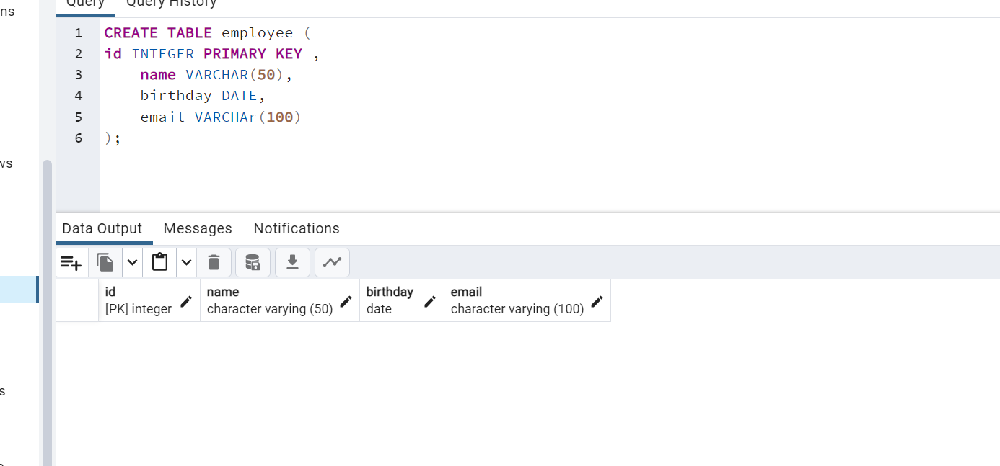
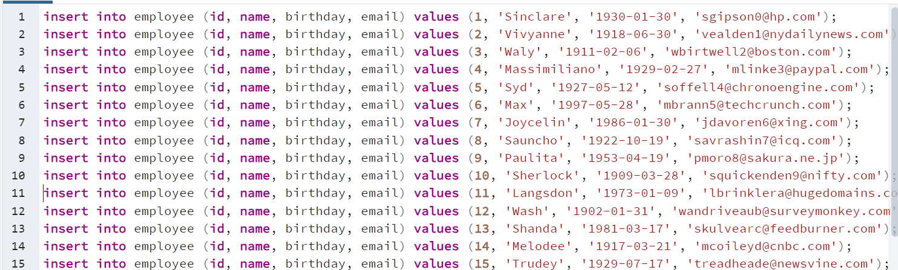
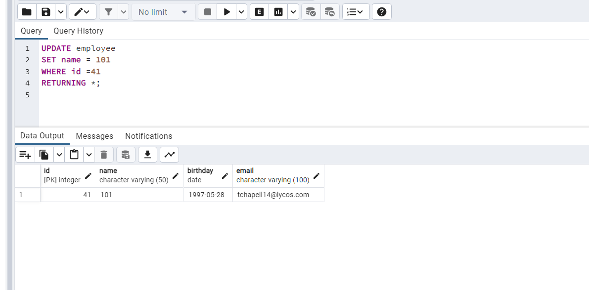
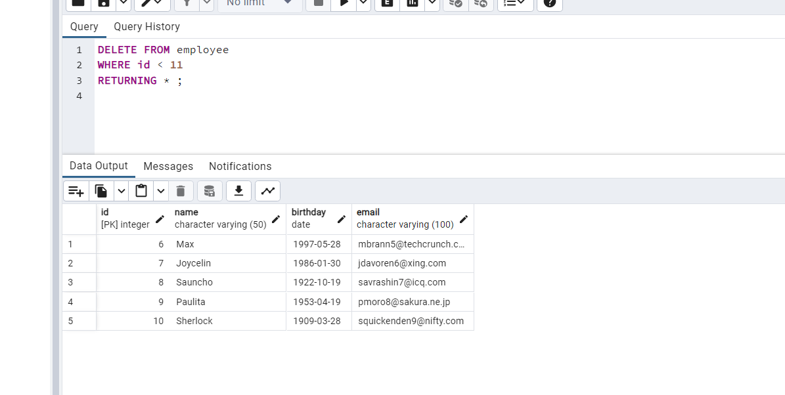

1. test veritabanınızda employee isimli sütun bilgileri id(INTEGER), name VARCHAR(50), birthday DATE, email VARCHAR(100) olan bir tablo oluşturalım.

-------------------

2. Oluşturduğumuz employee tablosuna 'Mockaroo' servisini kullanarak 50 adet veri ekleyelim.

------------------

3. Sütunların her birine göre diğer sütunları güncelleyecek 5 adet UPDATE işlemi yapalım.

UPDATE employee
SET id = 101
WHERE id =2
RETURNING *;

-------------------

4. Sütunların her birine göre ilgili satırı silecek 5 adet DELETE işlemi yapalım.

